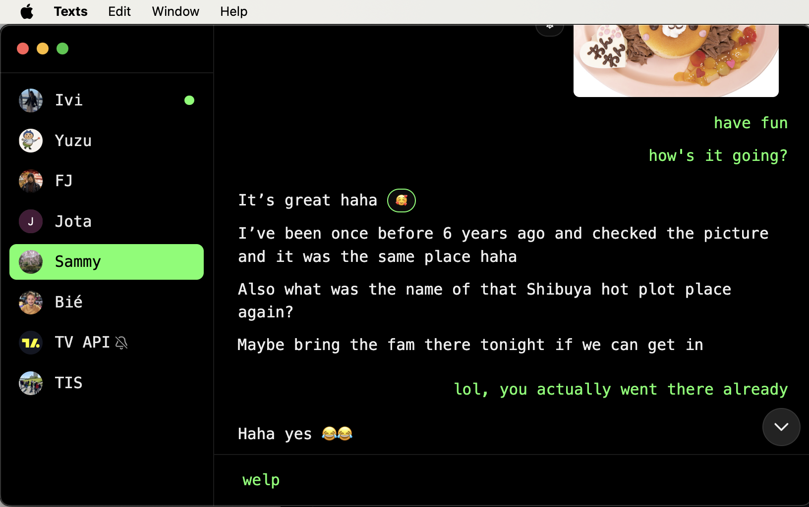
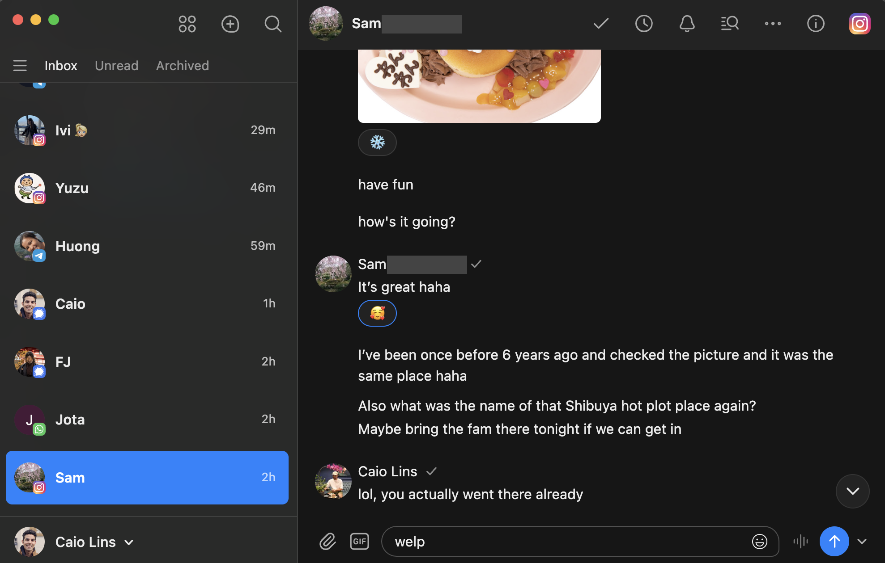
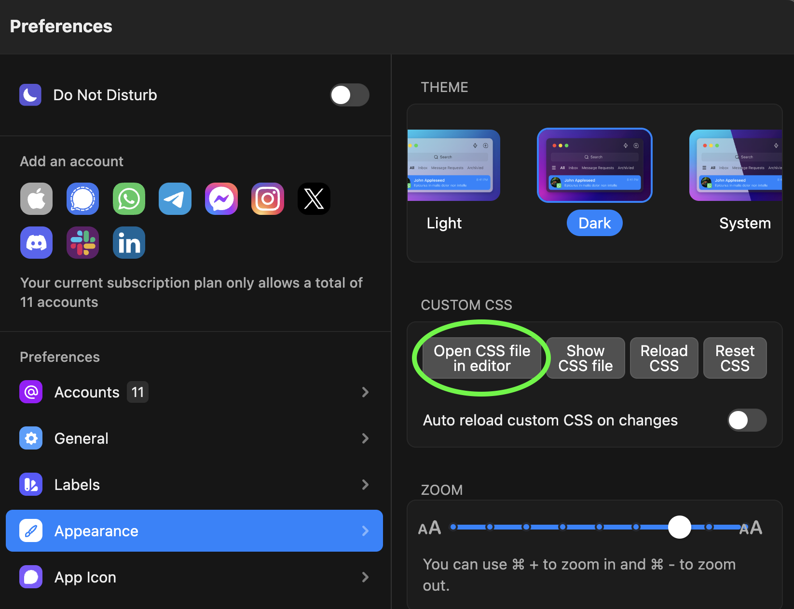
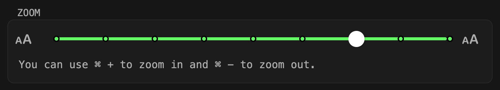

# ✨ overview
a pretty opinionated minimalist theme for [texts](https://texts.com/) messaging app that attempts to strip down the chatting experience to the very basics. Let's call this theme simply "`minimalist`" for now. This might change in the future as we could have many variations of a `minimalist` theme.

### 😎 with theme


### 🫢 without theme



# 🛠️ how to use it
"i don't care about anything else, just make my chat app minimalist". say no more. by the way, this guide assumes you have [texts](https://texts.com/) installed and ready to go.
## 👨🏻‍💻 i'm familiar with a terminal
my recommendation for the more experienced folk.
### 1. download the theme
👉🏼 clone the repository somewhere using git or something.
### 2. apply minimalist theme
👉🏼 we can do so by replacing the existing custom.css file inside the texts directory with the one in the repository cloned in step 1. we can achieve this by creating a symbolic link to the file. example for unix below.
```
ln -sf /path-to-directory-with-repo/texts-minimalist-theme/custom.css /path-to-texts-directory/custom.css
```
ℹ️ make sure to backup any custom css (if you applied any).
### 3. reload custom css
👉🏼 since you have a symbolic link, everytime you pull a new version of the theme it'll automatically update the one in the texts directory with it. then you can hit 'reload css' or you could also tick 'auto reload custom css on changes'. entirely up to you.
## 🐥 i have never opened a terminal in my life
fair enough ... 
### 1. copy contents of custom.css to your clipboard
👉🏼 here is the link to the file for convenience: [custom.css](https://raw.githubusercontent.com/clins777/texts-minimalist-theme/main/custom.css).
### 2. open the existing custom.css from texts app settings
👉🏼 go to appearance settings and click the 'open css file in editor' button as shown on the screenshot below.


### 3. update custom.css
⚠️ you might get stuck here if you didn't setup a default editor for css files so google how to do that first then repeat step 2. otherwise keep going.

👉🏼 paste what you copied from 1 in the editor and save the file.
### 4. apply the theme
👉🏼 click 'reload css' button and your theme should now be applied.

# 🫰🏼 features
ℹ️ if you'd like to disable some features i've left a tag, such as `SIDEBAR_PLATFORM_ICON` for hiding platform icons on the sidebar, next to the feature so you can easily find it in the css and comment it out. not every feature has this at the moment. if you're having trouble disabling a specific feature, please submit an issue and i'll have a look for you.
### ⬅️ side bar
- ✅ hide all, unread, archive tabs
- ✅ hide time stamps in each message
- ✅ shorten 'thread' height
- ✅ hide scroll bar
### 💬 chat
- ✅ hide dates in chat wherever they appear (cause ain't nobody got time for that)
- ✅ hide various input commands near where you type message (use keyboard shortcuts instead)
- ✅ hide 'seen by' avatars
- ✅ hide the avatar + contact's name title on the top (avatar still shown on groups)
- ✅ hide placeholder text in the message input by making it transparent
- ✅ hide most gaps between messages
- ✅ hide unread divider line
- ✅ message flex direction is row instead of column so that reactions aligned horizontally
- ✅ reactions are centered vertically to the right of the message
- ✅ hide message reply sender names 
- ✅ hide scroll bar
- ✅ hide 'user is typing' notice
- ✅ truncate linked messages to one liner
- ✅ hide 'edited xm ago' labels on messages (`CHAT_MESSAGE_EDITED_LABEL`)
### 🤷🏻‍♂️ others
- completely omitted reels or related content (`CHAT_HIDE_REELS_OR_SIMILAR`)
- omitted platform icons on the sidebar (`SIDEBAR_PLATFORM_ICON`)
- aligned your own messages to the right
- made primary color (`--color-primary`) green `rgb(100, 255, 100)` (feel free to change it)
- hide 'instagram user is in quiet mode' action (`CHAT_HIDE_IG_USER_IN_QUIET_MODE_ACTION`)
- hide 'user joined group' action (`CHAT_HIDE_USER_JOINED_ROOM_ACTION`)
# 😔 known regressions
- side bar width became fixed and can't be resized from ui
- pinned chats became clunky, i'd avoid using it (let's do something about it later)
# 👀 disclaimers
So far I've only tested on `MacOS` with the following `Appearance` settings
### sidebar
- ❌ everything off
### right pane
- ❌ everything off except 'show stealth mode indicator'
### toolbar
- ❌ everything off
### ui experiments
- ❌ everything off
### theme
- ✅ dark
- ❌ light (might not look as good)
### zoom


# 💡 contributing
if you find any bug or would like to improve something feel free to open an issue or submit a pr to this repo.
# 🤝 credits
if you're reading this, i'd just like to take a moment to say thanks for the interest! i spent quite a bit of time on this on my own just for fun. i hope you enjoy using it as much as i did making it. couldn't of done it without the folks at [TextsHQ](https://github.com/TextsHQ) of course for making such a great chat app and [KishanBagaria](github.com/KishanBagaria) for putting [TextsHQ/desktop-css](https://github.com/TextsHQ/desktop-css) on GitHub which i heavily referenced for this project.
### 🩷 sponsor me
please consider sponsoring me so i can keep making open source software like this one: [sponsor me](https://github.com/sponsors/clins777).
# 📜 license
[MIT](LICENSE) License © 2024-Present [Caio Lins](github.com/clins777)
